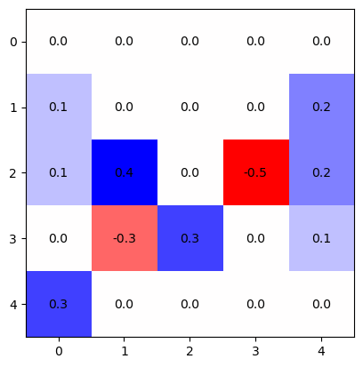
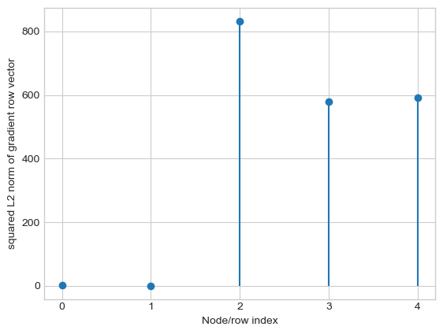
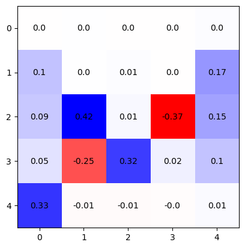

# A two-phase gradient-based heuristic for Exponential multivariate Hawkes Processes

Source code for [Granger Causal Chain Discovery for Sepsis-Associated Derangements via Multivariate Hawkes Processes].

It includes 
(1) simulation of linear MHP with both excitation and inhibitation effects; 
(2) log-likelihood calculation; 
(3) calculation of the gradient of the surrogate likelihood.

Moreover, we also provide a time-series version in my_functions_TS.py

## Example

An example of how to simulate multiple MHP sequences and how to perform the two-phase algorithm are shown below.

### Data generation 

```py
import numpy as np
import time
import matplotlib.pyplot as plt
from matplotlib import colors
from src import my_functions
import scipy as sp
from scipy.linalg import expm
from src import rand_DAG_generation

# %% set-up

d = 5

beta = 0.8
B = beta

[mu, A] = rand_DAG_generation.my_rand_DAG(d)
# feel free to use your own code the generate the problem parameters


# plot the true matrix
plt.style.use("default")

true_mat = A 
d = true_mat.shape[0]
  
divnorm=colors.TwoSlopeNorm(vmin=-true_mat.max(), vcenter=0., vmax=-true_mat.min())
plt.figure()
fig, ax = plt.subplots()
im = ax.imshow(-true_mat,cmap="bwr",norm = divnorm)

for i in range(d):
    for j in range(d):
        text = ax.text(j, i, np.round(true_mat[i, j]*100)/100,
                        ha="center", va="center")
plt.show()
plt.close() 

# %% MHP data generation

T = 240
M = 100
M_train = M


tmp_seed_2 = 1234
np.random.seed(tmp_seed_2)

tmp_t = time.time()
[all_event_time_all , all_event_idx_all] = my_functions.generate_multi_seq_multivariate_Hawkes(T,mu,A,beta,M)
elapsed = time.time() - tmp_t

print("data generation elapsed time is:",elapsed)
# data generation elapsed time is: 2.016613245010376

all_event_time = all_event_time_all.copy()[0:M_train]
all_event_idx = all_event_idx_all.copy()[0:M_train]


num_of_seq = M_train
tmp_t = time.time()
true_log_lik = my_functions.exp_kernel_log_lik_for_multiple_seq(all_event_time[0:num_of_seq], all_event_idx[0:num_of_seq], mu, A, beta, num_of_seq)
print("log likelihood on ground truth is:", true_log_lik)
# log likelihood on ground truth is: -35052.308987812874
elapsed = time.time() - tmp_t

print("log lik evaluation elapsed time is:",elapsed)
# log lik evaluation elapsed time is: 0.20827794075012207
```




### Phase 1: naive PGD

```py
memory_length = 8
batch_size = M


lr = 3e-2
lr_thres = 1e-6
min_grad = np.inf
ep_num_p1 = 1000

tmp_seed_p1 = 1234
np.random.seed(tmp_seed_p1)

# random initialization
mu0 = np.abs(np.random.rand(1,d))[0] * 0.05
#A0 =  np.abs(np.random.rand(d,d)) * 0.05
A0 = np.zeros([d,d])


my_log_lik = my_functions.exp_kernel_log_lik_for_multiple_seq(all_event_time, all_event_idx, mu0, A0, beta, M_train)
log_lik_traj = [my_log_lik]
print("initial log likelihood is:", my_log_lik)
# initial log likelihood is: -49715.85532390992


err_mu = []
err_A = []


mu_traj = [mu0]
A_traj = [A0]

mu_grad_norm_traj = [np.inf]
A_grad_norm_traj = [np.inf]

tmp_t = time.time()

for ep_idx in range(ep_num_p1):    
    
    [ pl_pmu , pl_pA ] = my_functions.my_penalized_GD_with_log_barrier_update(all_event_time, all_event_idx, mu0, A0, B, M_train, batch_size = batch_size, 
                                                                  log_barrier = False, penalty = None, memory_length = memory_length)        
    tmp_grad_norm_mu = np.sqrt((pl_pmu**2).sum())
    tmp_grad_norm_A = np.sqrt((pl_pA**2).sum())
    
    #constant step length
    mu0 += lr*pl_pmu/tmp_grad_norm_mu
    A0 += lr*pl_pA/tmp_grad_norm_A
    
    # projection
    A0[A0 < 0] = 0
    mu0[mu0 < 0] = 0
    
    # save the traj  
    err_mu.append(np.sum(np.abs(mu-mu0)))
    err_A.append(np.sum(np.abs(A-A0)))
    
    mu_traj.append(mu0.copy())    
    A_traj.append(A0.copy())
    
    mu_grad_norm_traj.append(tmp_grad_norm_mu)  
    A_grad_norm_traj.append(tmp_grad_norm_A)  
       

    if ((ep_idx+1) % 50) == 0:
        
        if ((ep_idx+1) % 250) == 0:
            lr /= 5
        
        my_log_lik = my_functions.exp_kernel_log_lik_for_multiple_seq_finite_memory(all_event_time, all_event_idx, mu0, A0, beta, M_train, memory_length = 2*memory_length)
    
        log_lik_traj.append(my_log_lik)        
        
        elapsed = time.time() - tmp_t
        
        
        print("iter",ep_idx+1,"elapsed time is hour:",elapsed/3600.0)
        print("log likelihood is:", my_log_lik)


# plt.style.use('seaborn-whitegrid')
# plt.figure()
# plt.plot(np.log(err_A))
# plt.xlabel('num. of iter.')
# plt.ylabel('log of l1 error on A')
# plt.show()

```

### Determine the coordinate on which we apply phase 2 GD

```py
GD_norm = (np.sum((pl_pA)**2,1))
total_norm = sum(GD_norm)
CD_order = np.argsort(-GD_norm) 

total_prop = 0

cor_GD_collection = []

for tmp_idx in CD_order:
    
    if total_prop >= 0.95:
        break
    
    total_prop += GD_norm[tmp_idx]/total_norm
    print(total_prop)
    cor_GD_collection.append(tmp_idx)
    

from matplotlib import collections as matcoll

x = np.arange(0,d)
y = GD_norm

lines = []
for i in range(len(x)):
    pair=[(x[i],0), (x[i], y[i])]
    lines.append(pair)
    
plt.figure(figsize=(4,2.5))
linecoll = matcoll.LineCollection(lines)
fig, ax = plt.subplots()
ax.add_collection(linecoll)

plt.scatter(x,y)
plt.xlabel('Node/row index')
plt.ylabel('squared L2 norm of gradient row vector')
plt.xticks(x)
plt.show()
```

This part of algorithm helps locate a small batch of coordinates on which we need further perform GD.



### Phase 2 (batch) Coordinate GD

```py
memory_length = 8
batch_size = M

ep_num = 500

lr_thres = 1e-5
min_grad = np.inf
lb_value = 0.1
lambda_lb_value = 0.1  

mu1 = mu0.copy()
A1= A0.copy()
 

for target_idx in cor_GD_collection:
    
    print("================= idx:",target_idx,"=================")

    
    tmp_seed = 1234
    
    file_name = "results/(p2)GDnaive_d_" + str(d) + "_idx_" + str(target_idx) + "_seed_" + str(tmp_seed) 
    
    np.random.seed(tmp_seed)
    
    
    err_mu_naiveGD = [np.inf]
    err_A_naiveGD = [np.inf]
    
    barrier_traj_naiveGD = [np.inf]
    
    
    mu_traj_naiveGD = [mu1]
    A_traj_naiveGD = [A1]
    
    mu_grad_traj_naiveGD = []
    A_grad_traj_naiveGD = []
    
    
    mu_grad_norm_traj_naiveGD = [np.inf]
    A_grad_norm_traj_naiveGD = [np.inf]
    
    mu_grad_norm_traj_naiveGD0 = [np.inf]
    A_grad_norm_traj_naiveGD0 = [np.inf]
    
    
    # part 1: optimize A
    tmp_t = time.time()
    lr = 1e-2
    
    for ep_idx in range(ep_num):   

        pl_pA_target_0 = my_functions.my_penalized_GD_with_log_barrier_update_A(all_event_time, all_event_idx, target_idx, mu1, A1, B, M_train, batch_size = batch_size, 
                                                                      log_barrier = False, penalty = None, memory_length = memory_length)        
 
        
        pl_pA_target = pl_pA_target_0
        
        #tmp_grad_norm_mu0 = np.sqrt((pl_pmu0**2).sum())
        tmp_grad_norm_A0 = np.sqrt((pl_pA_target_0**2).sum())
        
        tmp_grad_norm_A = np.sqrt((pl_pA_target**2).sum())
        
         
        
        if tmp_grad_norm_A0 <= A_grad_norm_traj_naiveGD0[-1]:
                    
            for tmp_idx in [target_idx]:
                A1[tmp_idx,:] += lr*pl_pA_target/tmp_grad_norm_A
                # mu1[tmp_idx] += lr*pl_pmu[tmp_idx]/tmp_grad_norm_mu
                # mu1[mu1 < 0] = 0        
            # save the traj_naiveGD
            
            err_A_naiveGD.append(np.sum(np.abs(A-A1)))
            
            A_traj_naiveGD.append(A1.copy())
            
            A_grad_norm_traj_naiveGD.append(tmp_grad_norm_A) 
            
            A_grad_norm_traj_naiveGD0.append(tmp_grad_norm_A0) 
            
        else:
            
            lr /= 2
            print("lr =",lr)
            
            if lr <= lr_thres:
                break
    
            err_A_naiveGD = err_A_naiveGD[:-1]
            
            A_traj_naiveGD = A_traj_naiveGD[:-1]
            
            A_grad_norm_traj_naiveGD = A_grad_norm_traj_naiveGD[:-1]
            
            A_grad_norm_traj_naiveGD0 = A_grad_norm_traj_naiveGD0[:-1]        
            
            A1 = A_traj_naiveGD[-1]
  
    
        if ((ep_idx+1) % 100) == 0:

            elapsed = time.time() - tmp_t
            
            print("iter",ep_idx+1,"elapsed time is hour:",elapsed/3600.0)
            print("A L1 err =",err_A_naiveGD[-1])           


    # part 2: optimize mu    
    tmp_t = time.time()
    lr = mu1[target_idx]/10
    
    for ep_idx in range(ep_num):    

        pl_pmu_target_0 = my_functions.my_penalized_GD_with_log_barrier_update_mu(all_event_time, all_event_idx, target_idx, mu1, A1, B, M_train, batch_size = batch_size, 
                                                                      log_barrier = False, memory_length = memory_length)        
        pl_pmu_target = pl_pmu_target_0

        tmp_grad_norm_mu0 = np.sqrt((pl_pmu_target_0**2).sum())

        tmp_grad_norm_mu = np.sqrt((pl_pmu_target**2).sum())
   
        
        if tmp_grad_norm_mu0 <= mu_grad_norm_traj_naiveGD0[-1]:
        
            
            tmp_idx = target_idx
            
            mu1[tmp_idx] += lr*pl_pmu_target/tmp_grad_norm_mu
            mu1[mu1 < 0] = 0        
            # save the traj_naiveGD
            
            # here we still apply projected GD for mu. Therefore, when it becomes zero, there is no need to continue the iteration.
            if mu1[tmp_idx] == 0:
                break
            
            err_mu_naiveGD.append(np.sum(np.abs(mu-mu1)))
            
            mu_traj_naiveGD.append(mu1.copy())    
            
            mu_grad_norm_traj_naiveGD.append(tmp_grad_norm_mu)  
            
            mu_grad_norm_traj_naiveGD0.append(tmp_grad_norm_mu0)  
            
        else:
            
            lr /= 1.5
            print("lr =",lr)

            err_mu_naiveGD = err_mu_naiveGD[:-1]
            
            mu_traj_naiveGD = mu_traj_naiveGD[:-1]
            
            mu_grad_norm_traj_naiveGD = mu_grad_norm_traj_naiveGD[:-1]
            
            mu_grad_norm_traj_naiveGD0 = mu_grad_norm_traj_naiveGD0[:-1]
            
            mu1 = mu_traj_naiveGD[-1]    
    
        if lr <= lr_thres:
            break    
    
        if ((ep_idx+1) % 50) == 0:
            

            elapsed = time.time() - tmp_t
            
            print("iter",ep_idx+1,"elapsed time is hour:",elapsed/3600.0)
            print("mu L1 err =",err_mu_naiveGD[-1])    


# plot the recovered matrix
plt.style.use("default")

true_mat = A1    
d = true_mat.shape[0]
  
divnorm=colors.TwoSlopeNorm(vmin=-true_mat.max(), vcenter=0., vmax=-true_mat.min())
plt.figure()
fig, ax = plt.subplots()
im = ax.imshow(-true_mat,cmap="bwr",norm = divnorm)

for i in range(d):
    for j in range(d):
        text = ax.text(j, i, np.round(true_mat[i, j]*100)/100,
                        ha="center", va="center")
plt.show()
plt.close()
```
We can see this recovered adjacency matrix (left) is very close to the true one (right).

  

## Dependencies

This code was implemented using Python 3.8 and mainly built on Numpy.

## Installation

Copy all files in the current working directory.

## Author

Song Wei <song.wei@gatech.edu>


